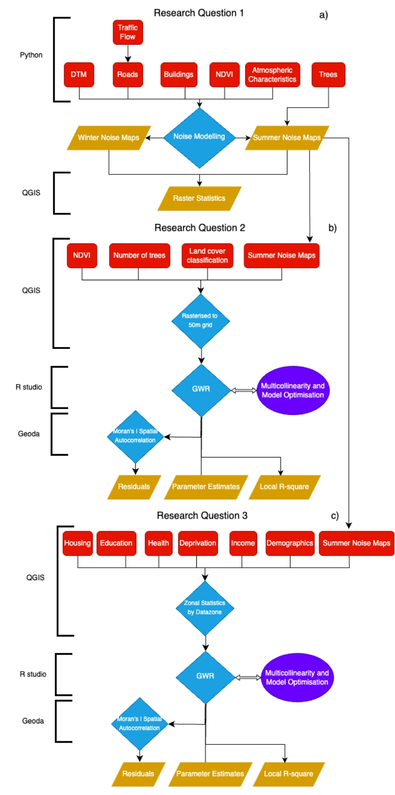

# An Analysis of Seasonal Vegetation and Social Disparities in Road Traffic Noise Exposure in Glasgow and Edinburgh, Scotland

*Figure: Sample modelled seasonal road traffic noise in Edinburgh.*

### Abstract
***
Despite the projected increase in noise pollution due to urban growth and mobility demands, noise remains the ignored or forgotten pollutant. While recent regulations in Europe and Scotland have partially ameliorated this knowledge gap, simulations of noise pollution have generally not considered the acoustic effects of seasonal vegetation. This study assesses the impact of seasonal vegetation on road traffic noise in Glasgow and Edinburgh, UK. It also investigates how road traffic noise is related to various sociodemographic indicators of the Scottish Index of Multiple Deprivation (SIMD). The NoiseModelling library is used to model road traffic noise seasonally in the two study areas. Geographically Weighted Regressions (GWRs) are calculated in R to analyse how vegetation impacts noise and how noise is related to dependency ratios, health outcomes, ethnicity, and housing factors. Seasonal vegetation was found to have a measurable decrease in modelling noise intensity from traffic, with greater effects in Glasgow than Edinburgh. Dependency ratio was negatively correlated with road traffic noise and was the only globally significant variable across both study areas. The relationships with health, housing, and percent of ethnic minorities were extremely localised and explained more of the variation in noise levels in Glasgow than Edinburgh. This study reveals incorporating seasonal vegetation into noise modelling can improve our understanding of noise exposure with implications for green noise abatement policies in Scotland. Further research into socioeconomic vulnerabilities and noise exposure should be geographically disaggregated to achieve more equitable cities aligned with Sustainable Development Goal 11 (Sustainable Cities and Communities). 
*** 

### Methods and Reproducibility

*Figure: Sample modelled seasonal road traffic noise in Edinburgh.*

This study generated noise maps of Edinburgh and Glasgow using the [NoiseModelling v5.0.0 library] (https://noisemodelling.readthedocs.io/en/latest/). The general workflow loosely follows the steps outlined in the [Noise Map from OSM - GUI tutorial](https://noisemodelling.readthedocs.io/en/latest/Noise_Map_From_OSM_Tutorial.html), but with the additional steps of using the NDVI as a groundcover absorption proxy, traffic counts from the [Department for Transport](https://roadtraffic.dft.gov.uk/local-authorities), and including trees in the calculations. 

All the code used to pre-process the data and calculate the Geographically Weighted Regressions (GWRs) can be found in the Environmental and Traffic Scripts and GWR scripts folders respectively. The data used are available on request from the author at issyollie@gmail.com. 

